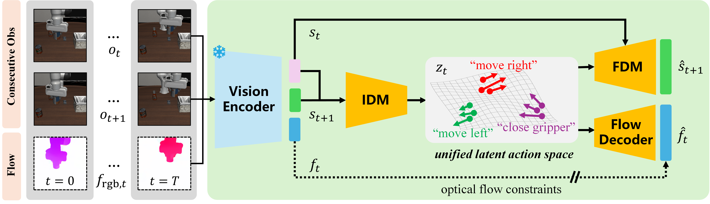
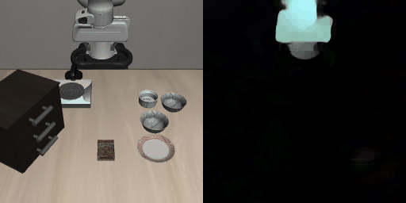
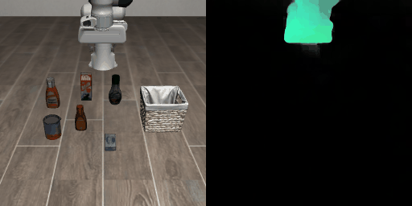
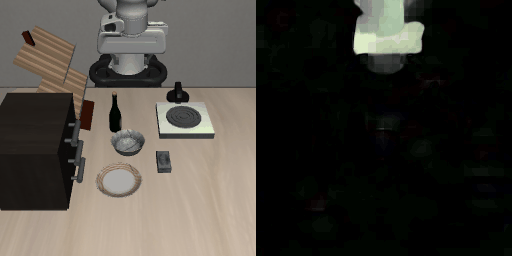
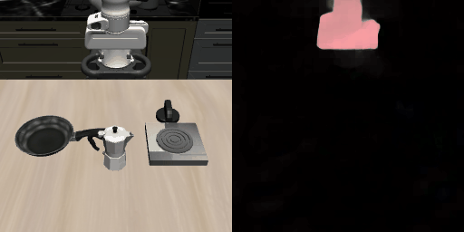

# LAOF: Robust Latent Action Learning with Optical Flow Constraints

[](https://arxiv.org/abs/2025.04999) [](https://opensource.org/licenses/MIT)

Official implementation of the paper: **"LAOF: Robust Latent Action Learning with Optical Flow Constraints"**.

[cite_start]**Authors**: [Xizhou Bu](https://github.com/XizoB)<sup>1</sup>, Jiexi Lyu<sup>1</sup>, Fulei Sun<sup>1</sup>, Ruichen Yang<sup>1</sup>, Zhiqiang Ma<sup>2</sup>, Wei Li<sup>1</sup> [cite: 2, 3]  
[cite_start]**Affiliations**: <sup>1</sup>Fudan University, <sup>2</sup>Northwestern Polytechnical University [cite: 4]

---

## Abstract

Learning latent actions from large-scale videos is crucial for pre-training scalable embodied foundation models. However, existing methods often struggle with action-irrelevant distractors (e.g., moving backgrounds). While action supervision can help, action labels are scarce.

We propose **LAOF (Robust Latent Action learning with Optical Flow constraints)**, a pseudo-supervised framework that leverages the agent's optical flow as an action-driven signal. By assuming that optical flow represents pixel-level motion naturally correlated with physical actions, LAOF learns robust latent action representations.

**Key Highlights:**
* **Optical Flow Constraints**: Introduces a flow decoder to enforce physical motion consistency on latent actions.
* **Object-Centric**: Uses LangSAM to filter dynamic distractors in complex environments (e.g., games).
* **High Efficiency**: Even **without** action supervision, LAOF matches or surpasses action-supervised methods trained with **1%** of action labels.

---

## Methodology

<div align="center">
  
</div>

### Visualization of Optical Flow
<p align="center">
  <span style="display:inline-block; text-align:center; margin:8px;">
    <br>
    <b>Spatial</b>
  </span>
  <span style="display:inline-block; text-align:center; margin:8px;">
    <br>
    <b>Object-centric</b>
  </span>
</p>

<p align="center">
  <span style="display:inline-block; text-align:center; margin:8px;">
    <br>
    <b>Goal-oriented</b>
  </span>
  <span style="display:inline-block; text-align:center; margin:8px;">
    <br>
    <b>Long-horizon</b>
  </span>
</p>

<p align="center">
  <span style="display:inline-block; text-align:center; margin:8px;">
    <br>
    <b>BigFish</b>
  </span>
  <span style="display:inline-block; text-align:center; margin:8px;">
    <br>
    <b>Chaser</b>
  </span>
</p>

<p align="center">
  <span style="display:inline-block; text-align:center; margin:8px;">
    <br>
    <b>Leaper</b>
  </span>
  <span style="display:inline-block; text-align:center; margin:8px;">
    <br>
    <b>Heist</b>
  </span>
</p>


### Architecture
LAOF extends the Latent Action Policies (LAPO) paradigm by integrating a **Flow Decoder**. The training pipeline consists of three stages:

1.  **Pre-training (Unsupervised)**:
    * Input: Consecutive observations $(o_t, o_{t+1})$ and RGB-formatted optical flow $f_{rgb,t}$.
    * **IDM**: Infers latent action $z_t$.
    * **FDM**: Predicts next state $\hat{s}_{t+1}$.
    * **Flow Decoder**: Decodes $z_t$ into predicted optical flow $\hat{f}_t$.
    * **Objective**: Minimizes reconstruction loss + optical flow constraint loss.
        $\mathcal{L}_{pretrain} = \mathcal{L}_{reconstruction} + \mathcal{L}_{flow}$

2.  **Distillation**:
    * Transfers the learned IDM representations to a latent policy $\pi$ using language instructions $l_t$.

3.  **Fine-tuning**:
    * Trains a lightweight action decoder to map latent actions to physical actions using a small set of labeled data.

### Optical Flow Processing
* **Static Backgrounds**: Uses standard **RAFT** flow estimation.
* **Dynamic Distractors**: Applies **LangSAM** to generate object-centric masks, filtering out non-agent motion.
* **Format**: Converts flow $(u, v)$ to RGB (HSV) for unified processing with visual encoders (DINOv2).

---

## Installation

```bash
git clone [https://github.com/XizoB/LAOF.git](https://github.com/XizoB/LAOF.git)
cd LAOF
conda create -n laof python=3.10
conda activate laof
pip install -r requirements.txt